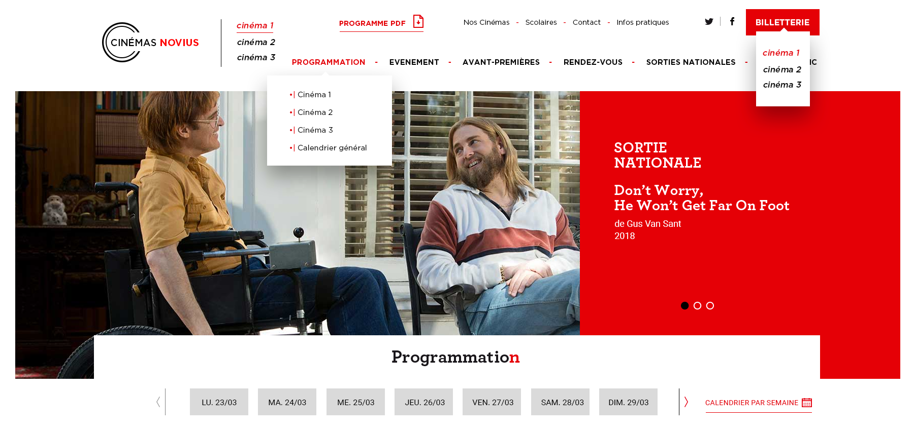

# Novius - Test Technique front-end

## Objectif

Faire l’intégration HTML / CSS / JS d’une partie de la page d'accueil du site fictif Cinémas Novius (header + slider + accès programmation), de la manière la plus fidèle et la plus propre possible (animations, rollover…).

## Le principe

* Le résultat final doit fonctionner correctement dans un navigateur moderne : il sera testé avec les dernières versions stables de Chrome et Firefox, sans plugin ;
* Le test n’est pas chronométré ;
* Sass, PostCss, Gulp, CSS, Webpack, React, Vue, Open Office... vous utilisez les technos que vous souhaitez, tant qu’elles vous paraissent adaptées.

## Ressources

* Le fichier `docs/images/page.png` correspond à un screenshot du résultat final à obtenir ;
* Le fichier [page.psd](https://drive.google.com/file/d/1dIQ5H9Trkpk_mCpT-_ZsR2sNz0gT1U4c/view?usp=sharing) correspond à la source .psd du résultat final à obtenir ;

## Branche de travail

Merci de travailler sur une branche `dev` pour permettre une review facile de votre travail.

## Rendu

Une fois terminé, merci d'envoyer un e-mail à `botalla@novius.fr` pour que l'on puisse analyser votre travail.

Vous pouvez joindre à votre email des remarques, votre méthodologie, les outils utilisés, ou tout ce que vous jugerez utiles afin de comprendre votre démarche.

## Espace libre candidat

Après l'entretient avec Tony j'ai compris que les technos habituelles chez Novius étaient Tailwind et Alipne.js. J'ai donc utilisé ces tech dans la réalisation du test d'intégration.

La lib *flatpicker* est utilisé afin d'optenir un style de calendrier consistant sur différents navigateurs.

Version en ligne : https://theogoedert.com/test-novius/